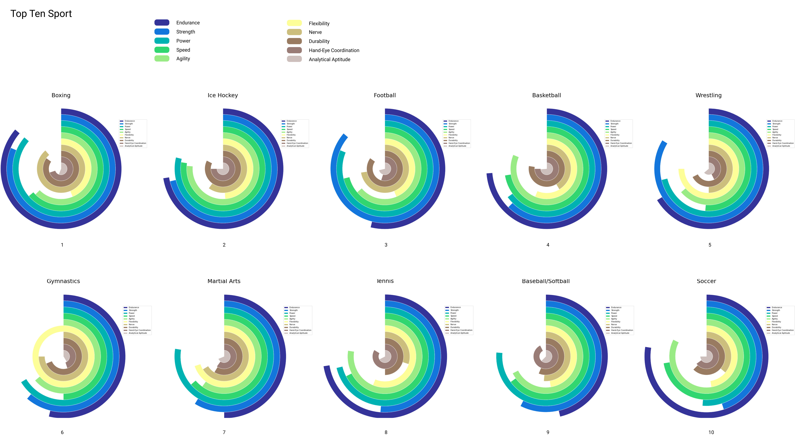

# Sport Data Analyze

Welcome to this small data visualization training project. The goal is to continue to take in hand pandas and Matplotlib for now. You can download the dataset [here](https://data.world/makeovermonday/2018w19-toughest-sport-by-skill).

The purpose of this analysis is to be able to observe more clearly the sports that are the most demanding in resources. I also had fun coding a function to make circular charts.

I wrote a few lines to tidy up the dataset, but it was already pretty clean.

## Top Ten Sport

